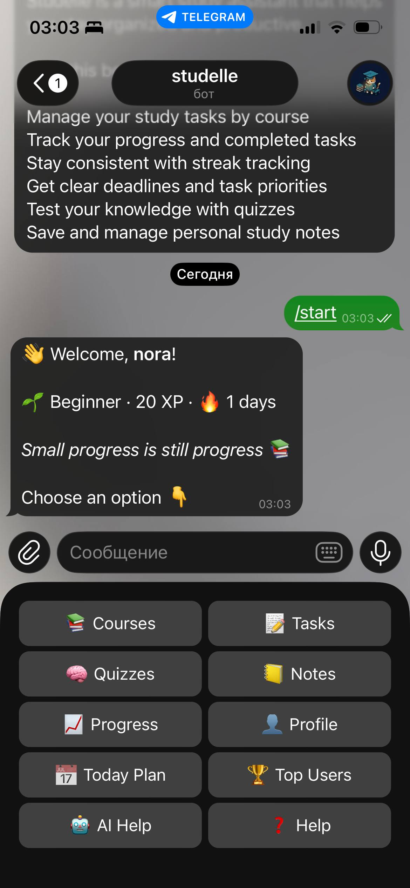
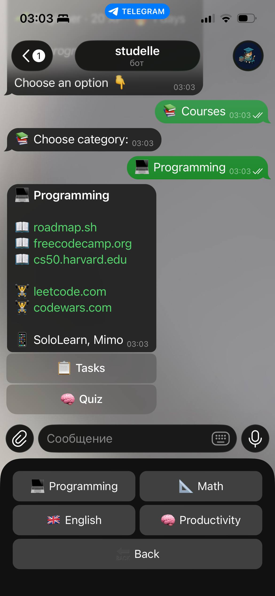
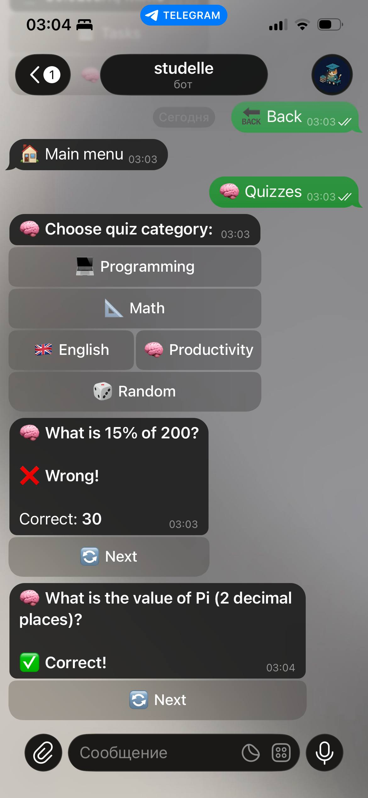
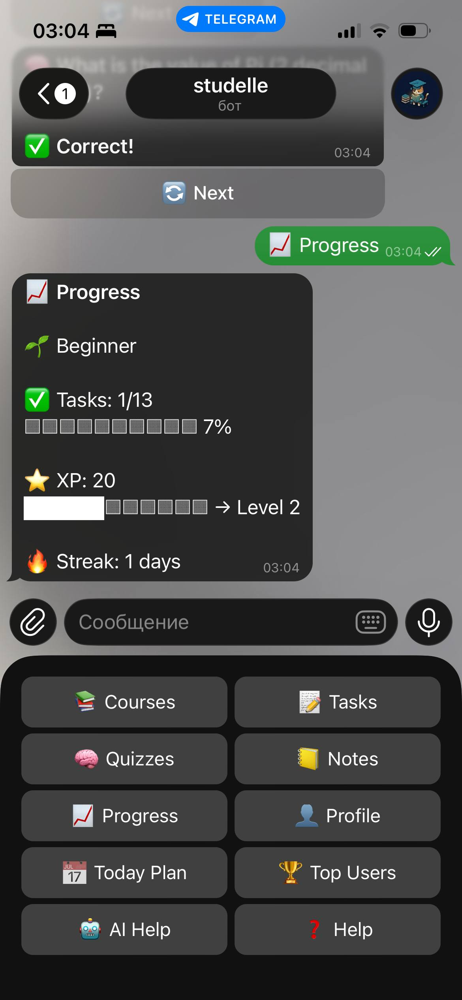
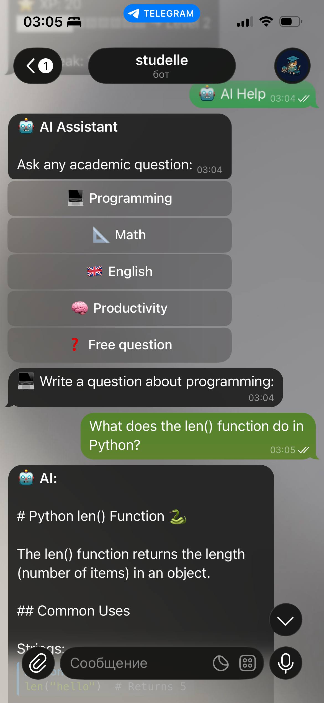
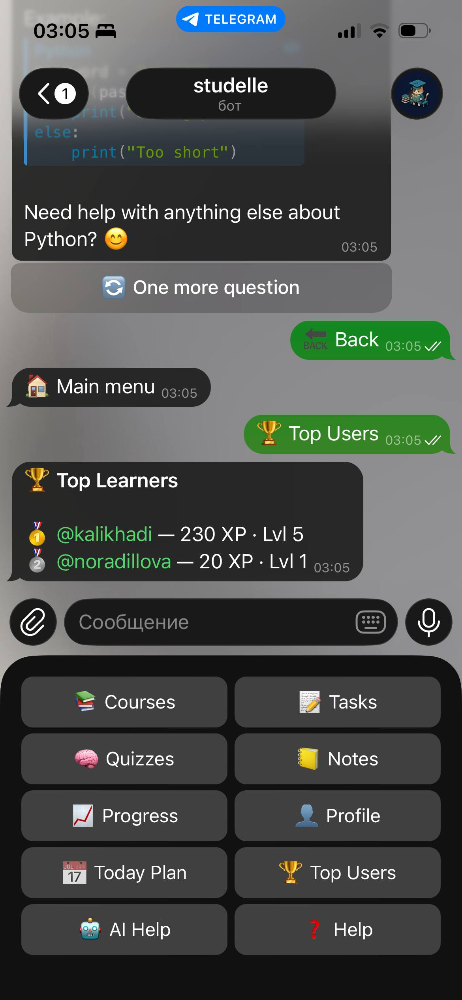

# 🎓 Studelle — Your Smart Study Companion

> *Study now, shine later ✨*

Studelle is a Telegram bot that turns studying into a structured, gamified and rewarding experience. No extra apps, no switching between platforms — just open Telegram and start learning.

---

## What is Studelle?

Studelle brings everything you need for effective studying into one place:
- Create and manage courses by subject
- Take AI-generated quizzes and earn XP
- Complete daily tasks with priority levels
- Save personal notes linked to topics
- Track your progress, streaks and level
- Compete with other learners on the leaderboard
- Get instant answers from a built-in AI assistant

---

## Technologies

| Technology | Purpose |
|-----------|---------|
| Python 3.13 | Core language |
| pyTelegramBotAPI | Telegram bot framework |
| Django | Admin panel & database |
| SQLite | Data storage |
| Anthropic Claude API | AI assistant |
| Railway | Cloud deployment |

---

## Installation

```bash
git clone https://github.com/noradillova/studellebot.git
cd studellebot
python -m venv venv
venv\Scripts\activate
pip install -r requirements.txt
```

Create `.env` file:

TOKEN=your_telegram_bot_token
ANTHROPIC_API_KEY=your_anthropic_api_key

---

## Running the Bot

```bash
python manage.py migrate
python bot.py
```

---

## Examples

| Command | Result |
|---------|--------|
| `/start` | Welcome message with XP and streak |
| `/ask` | Ask AI any academic question |
| `/stats` | View your progress |
| `/history` | Recent message history |

---

## Screenshots

### Main Menu


### Courses


### Quizzes


### Progress


### AI Help


### Top Users


---

## Author

**Nuraiym Adilova** — IITU University, 2026

> *Try it now: @studyelleBot*
